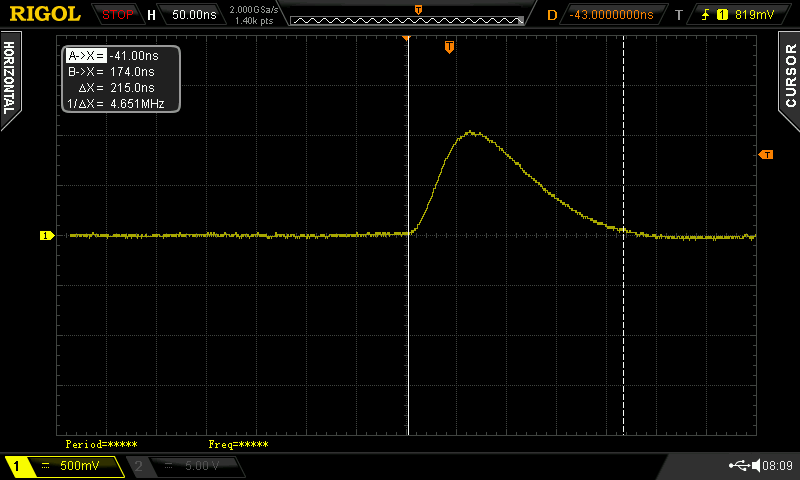

# AG-IUP32-8 module
Photomultiplier module with Hamamatsu R6237 tube out of an AGFA CR 30-X Xray plate digitizer.
This repository contains hardware schematics and a custom microcontroller firmware to use the module.
## Related work
Reverse engineering of this module on <a href="https://www.mikrocontroller.net/topic/288933">microcontroller.net</a> (german).

Reverse engineering of a relate module on <a href="https://highvoltageforum.net/index.php?topic=7.0">highvoltageforum.net</a>.

Collection of information from all these modules <a href="http://kaizerpowerelectronics.dk/high-voltage/photomultiplier-tube/">kaizerpowerelectronics.dk</a>.

## Connectors
### D-SUB 15
Main interface connector with supply voltage and I2C interface
| Pin Number    | Function      | Required      |
| ------------- | ------------- | ------------- |
| 1  | GND | y |
| 2  | -10 V | y |
| 3  | GND | n |
| 4  | +5 V | y |
| 5  | PIC_I2C_SCL | y |
| 6  | external EEPROM_I2C_SCL | n |
| 7  | ? | n |
| 8  | GND | n |
| 9  | +20 V | y |
| 10 | GND | n |
| 11 | GND | n |
| 12 | PIC_I2C_SDA | y |
| 13 | external EEPROM_I2C_SDA | n |
| 14 | PIC_2MHz_clock | y |
| 15 | ? | n |
| RF | Amplified PMT signal output | y |

### D-SUB 9
Connector for external calibration LED and photodiode, these parts did not come with my unit, so I have no information about these parts.
Used pins are Pin 2 and Pin 3, all others GND.

## Recorded traced for the D-SUB 15 RF output in operation

